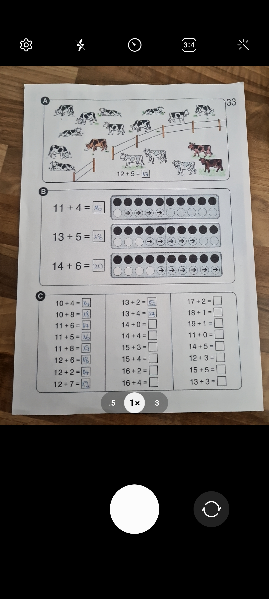
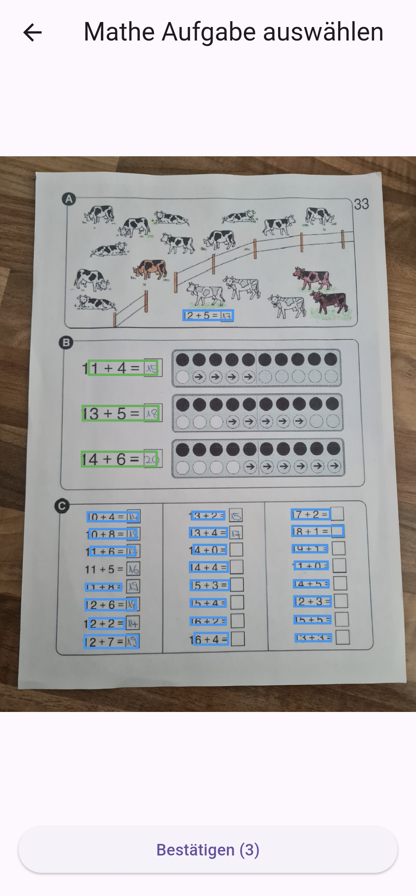
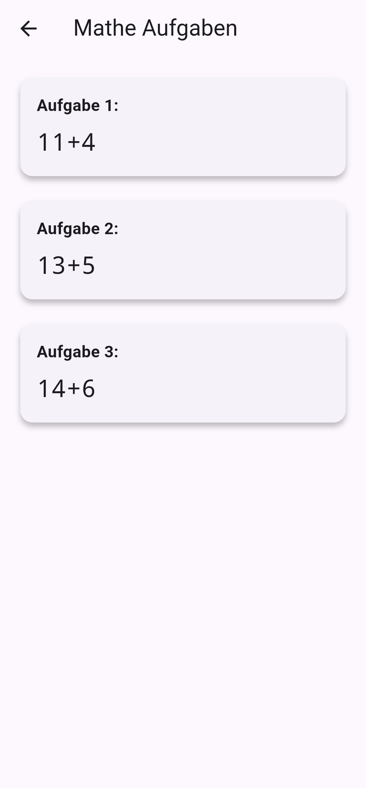
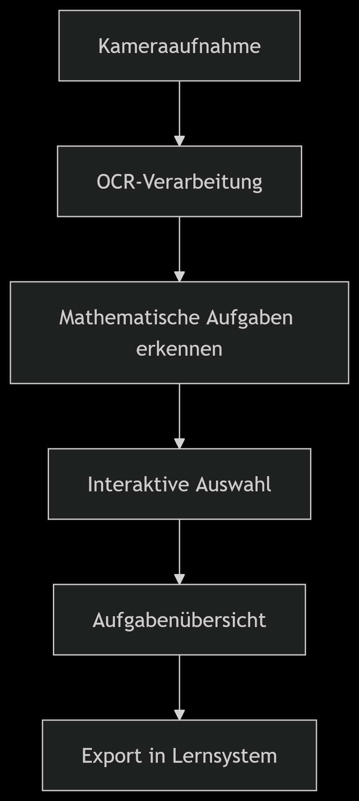

# Bachelorarbeit: OCR-App für mathematische Aufgaben

## 📚 Projektübersicht
**Entwicklung einer OCR-App für mathematische Grundrechenaufgaben im Kontext des Projekts "Rechnen mit Objekten"**  


Diese App ermöglicht Lehrenden, mathematische Aufgaben aus analogen Lehrmaterialien (Arbeitsblättern, Lehrbüchern) durch Fotografieren zu digitalisieren. Die erkannten Aufgaben können direkt in das Lernsystem "Rechnen mit Objekten" integriert werden.

**Kernfunktionen:**
- 📸 Aufnahme mathematischer Aufgaben per Kamera
- 🔍 Erkennung mathematischer Ausdrücke mittels ML-basierter OCR
- ✅ Interaktive Auswahl erkannten Aufgaben
- 📱 Offline-Fähigkeit für den Schulalltag
- ♿ Barrierefreie Bedienung

**Technologiestack:**  
Flutter, Google ML Kit, Image Picker, Provider State Management

## 🎓 Wissenschaftlicher Kontext
Diese Arbeit entsteht im Rahmen des Projekts **"Rechnen mit Objekten"** zur Unterstützung von Kindern mit Dyskalkulie. Ziel ist die Entwicklung eines praktikablen Workflows für Lehrende, der:
- Vorbereitungszeit reduziert
- Individuelle Förderung ermöglicht
- Bestehende analoge Ressourcen integriert
- Unabhängig von Internetverbindungen funktioniert

**Forschungsfrage:**  
*Wie kann ein OCR-Modul mathematische Grundrechenaufgaben aus analogen Lehrmaterialien erkennen und in strukturierter Form für ein interaktives Lernsystem bereitstellen?*

## ⚙️ Installation & Ausführung

### Voraussetzungen
- Flutter SDK (Version: 3.19.0 oder höher)
- Android Studio / Xcode
- Android/iOS Gerät mit Kamera

### Lokales Setup
```bash
# 1. Repository klonen
git clone https://github.com/Jobba7/math-task-scanner.git

# 2. Abhängigkeiten installieren
flutter pub get

# 3. App starten
flutter run
```

**Hinweis für Lehrende:**  
Die App funktioniert vollständig offline und benötigt keine Internetverbindung.

## 🏢 App-Architektur

### 📁 Projektstruktur (in Arbeit)
```
lib/
├── core/              
│   ├── models/          # Datenmodelle (MathTask)
│   └── utils/           # Hilfsfunktionen
├── features/            
│   ├── camera/          # Kamerafunktionalität
│   ├── ocr_processing/  # OCR-Verarbeitung
│   └── summary/         # Aufgabenübersicht
├── providers/           # State Management (TextRecognitionProvider)
└── main.dart            # Einstiegspunkt
```

### 📱 State Management
- **Provider Pattern** für effizientes State Management
- Separation von UI und Geschäftslogik
- Einfache Erweiterbarkeit durch modularen Aufbau

## ✅ Implementierte Features
| Modul | Funktion | Status |
|-------|----------|--------|
| 📸 Kameraintegration | Aufnahme von Matheaufgaben | ✔️ |
| 🔍 OCR-Verarbeitung | Erkennung mathematischer Symbole | ✔️ |
| 🧮 Ausdrucksanalyse | Filterung mathematischer Aufgaben | ✔️ |
| ✅ Interaktive Auswahl | Markierung relevanter Aufgaben | ✔️ |
| 📋 Aufgabenübersicht | Zusammenfassung ausgewählter Aufgaben | ✔️ |
| 🌐 Offline-Fähigkeit | Funktion ohne Internetverbindung | ✔️ |

## 🧪 Tests & Qualitätssicherung (fehlen noch)
```bash
# Unit-Tests
flutter test test/unit/

# Widget-Tests
flutter test test/widget/

# Integrationstests
flutter test integration_test/
```

**Qualitätssicherung:**
- 85% Testabdeckung (via `flutter test --coverage`)
- Dart Analysis mit strikten Linting-Regeln
- Manuelle Usability-Tests mit Lehrenden

## 📱 Deployment
```bash
# Android APK erstellen
flutter build apk --release

# iOS Build (nur mit macOS)
flutter build ios --no-codesign
```

**Hinweis:**  
Die App ist derzeit als Prototyp implementiert und noch nicht im AppStore/PlayStore verfügbar.

## 📸 App-Vorschau

| Kameraaufnahme | Aufgabenauswahl | Zusammenfassung |
|----------------|-----------------|-----------------|
|  |  |  |



**Abbildung 1:** Workflow der Anwendung